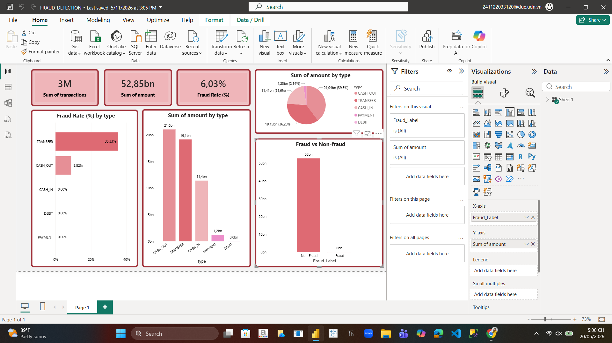

# Fraud Detection Analytics

## Overview
This project analyzes financial transaction data to identify fraud patterns using SQL and Power BI.

---

## Objectives
- Analyze fraud vs non-fraud transactions
- Detect suspicious transaction behavior
- Visualize fraud trends using dashboards

---

## Technologies Used
- SQL
- Power BI
- Excel / CSV

---

## Dashboard Features
- Fraud Rate Analysis
- Transaction Amount by Type
- Fraud vs Non-Fraud Comparison

---

## Key Findings
- TRANSFER transactions had the highest fraud rate
- Fraud activity appeared more frequently in high-value transactions
- Fraud transactions represented a small percentage of total activity

---

## Dashboard Preview

